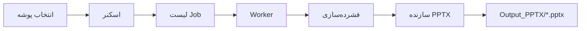
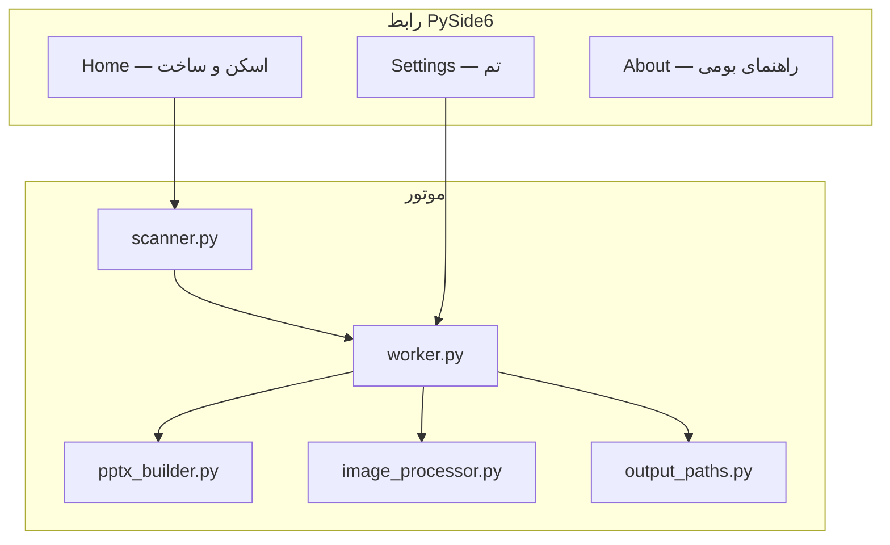
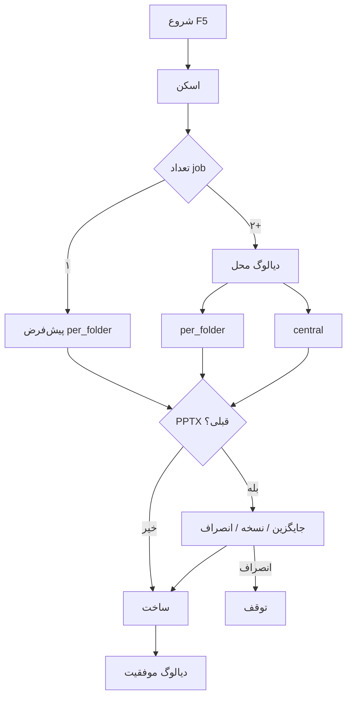

<div align="center">

[English](README.md) · **فارسی**


# Pics2PPT

**تبدیل خودکار پوشه‌های تصویری به گزارش پاورپوینت حرفه‌ای — فارسی، RTL، شبکه ۲×۲**

[](app/__init__.py)
[](LICENSE)
[](requirements.txt)
[](#نیازمندی‌های-سیستم)
[](#اجرای-تست‌ها)

</div>

---

## فهرست مطالب

<details open>
<summary><strong>پرش به بخش</strong></summary>

- [Pics2PPT چیست؟](#pics2ppt-چیست)
- [چرا استفاده کنیم؟](#چرا-استفاده-کنیم)
- [پیش‌نمایش رابط کاربری](#پیش‌نمایش-رابط-کاربری)
- [ویژگی‌های کلیدی](#ویژگی‌های-کلیدی)
- [پشته فناوری](#پشته-فناوری)
- [شروع سریع](#شروع-سریع)
- [EXE پرتابل (تک‌فایل)](#exe-پرتابل-تک‌فایل)
- [نحوه کار](#نحوه-کار)
- [محل خروجی و مدیریت تداخل](#محل-خروجی-و-مدیریت-تداخل)
- [الگوهای ساختار پوشه](#الگوهای-ساختار-پوشه)
- [رفتار فایل پاورپوینت خروجی](#رفتار-فایل-پاورپوینت-خروجی)
- [مرجع تنظیمات](#مرجع-تنظیمات)
- [دادهٔ جلسه در مقابل پایدار](#دادهٔ-جلسه-در-مقابل-پایدار)
- [میانبرهای صفحه‌کلید](#میانبرهای-صفحه‌کلید)
- [فرمت‌های پشتیبانی‌شده](#فرمت‌های-پشتیبانی‌شده)
- [محل و نام‌گذاری خروجی](#محل-و-نام‌گذاری-خروجی)
- [نیازمندی‌های سیستم](#نیازمندی‌های-سیستم)
- [توسعه](#توسعه)
- [اجرای تست‌ها](#اجرای-تست‌ها)
- [ساخت از سورس](#ساخت-از-سورس)
- [ساختار پروژه](#ساختار-پروژه)
- [عیب‌یابی](#عیب‌یابی)
- [محدودیت‌های صادقانه](#محدودیت‌های-صادقانه)
- [سؤالات متداول](#سؤالات-متداول)
- [فهرست مستندات](#فهرست-مستندات)
- [مشارکت](#مشارکت)
- [مجوز و سازنده](#مجوز-و-سازنده)

</details>

---

## Pics2PPT چیست؟

**Pics2PPT** یک برنامه دسکتاپ (Python + PySide6) است که پوشه‌های تصویری را اسکن می‌کند و **گزارش پاورپوینت فارسی RTL** می‌سازد:

- **شبکه ۲×۲** در هر اسلاید (حداکثر ۴ عکس، با حفظ نسبت تصویر)
- **اسلاید جداکننده بخش** برای پوشه‌های چندموضوعی
- **بزرگنمایی با کلیک** و **بزرگنمایی با هاور** در حالت Slideshow
- لوگو، پاورقی، فشرده‌سازی و تم — قابل تنظیم

یک پوشه ورودی انتخاب می‌کنید → برنامه ساختار را تشخیص می‌دهد → فایل‌های `.pptx` را در زیرپوشه خروجی می‌نویسد. برای **ریشه پروژه با چند job**، محل ذخیره را انتخاب می‌کنید: **داخل هر پوشه** (مثل کار دستی) یا **یکجا** در یک `Output_PPTX`.

> **معنی نام:** *Pics* (عکس) → *PPT* (پاورپوینت). کاربرد از روی اسم مشخص است.

> [!NOTE]
> Pics2PPT **کاملاً آفلاین** است. بدون تله‌متری، بدون آپلود ابری، بدون درخواست شبکه در حالت عادی.

---

## چرا استفاده کنیم؟

| مشکل | راه‌حل Pics2PPT |
|------|-----------------|
| صدها عکس میدانی در پوشه‌های تو در تو | تشخیص خودکار ساختار تخت، گروهی و ریشه پروژه |
| کپی دستی در اسلاید | ساخت دسته‌ای همه فایل‌ها |
| راست‌چین فارسی | پاراگراف RTL، فونت B Nazanin |
| حجم بالای JPEG | فشرده‌سازی Pillow + سقف ابعاد |
| نیاز به زوم در جلسه | اسلاید جزئیات با کلیک/هاور |
| کاربر غیرفنی در ویندوز | یک `Pics2PPT.exe` بدون نصب Python |
| گزارش کنار عکس‌های منبع | حالت **داخل هر پوشه** مثل کار دستی |
| جلوگیری از overwrite ناخواسته | دیالوگ **جایگزین / نسخه جدید `(۲)` / انصراف** |

---

## پیش‌نمایش رابط کاربری

```text
┌──────────────────────────────────────────────────────────────┐
│  [Logo] Pics2PPT          │  Home / Settings / About       │
│  عکس → پاورپوینت           │                                  │
├───────────────────────────┤  Input folder          [Browse]   │
│  ● ساخت گزارش              │  Footer text                     │
│    تنظیمات                 │  Logo L          Logo R          │
│    درباره                  │  [Start F5]  [Cancel]  [Clear]   │
│                           │  ▓▓▓▓▓▓▓▓░░░░  Progress          │
│                           │  Log (compact, ~88px)            │
└───────────────────────────┴──────────────────────────────────┘
```

| تب | کاربرد |
|----|--------|
| **ساخت گزارش** | انتخاب پوشه، پاورقی/لوگو، شروع، پاک کردن ورودی‌ها |
| **تنظیمات** | تم، پیش‌فرض‌ها، نام پوشه خروجی، کیفیت PPTX |
| **درباره** | نسخه، راهنمای RTL بومی، مرجع الگوهای پوشه |

---

## ویژگی‌های کلیدی

- **اسکنر هوشمند** — پوشه تخت، شخص+موضوع، گروه‌های شماره‌دار، ریشه پروژه
- **شبکه ۲×۲ widescreen** — ۱۶:۹ (۱۳٫۳۳ × ۷٫۵ اینچ)
- **جداکننده بخش** — اسلاید عنوان بین موضوعات
- **تعامل Slideshow** — زوم کلیک؛ زوم هاور با OpenXML
- **دو لوگو + پاورقی** — اختیاری در سربرگ هر اسلاید
- **سایه، حاشیه، کپشن** — نام فایل زیر تصویر (نه در سربرگ)
- **سه تم UI** — فیروزه‌ای تیره (پیش‌فرض)، ارغوانی تیره، روشن
- **انتخاب محل خروجی** — داخل هر پوشه یا یکجا
- **نوشتن امن** — جایگزین، نسخه `(۲)`، یا انصراف
- **تنظیمات پایدار** — `%USERPROFILE%\.pics2ppt\settings.json` (`settings_version: 4`)
- **ورودی جلسه پاک** — مسیر، پاورقی، لوگو در هر اجرا ریست می‌شوند
- **دیالوگ موفقیت** — باز کردن پوشه خروجی، ورودی، یا اولین PPTX
- **بیلد پرتابل** — یک EXE (~۵۰ مگ با UPX)
- **۳۸ تست خودکار**

---

## پشته فناوری

| لایه | فناوری |
|------|--------|
| زبان | Python 3.11+ |
| رابط | PySide6 (Qt6)، RTL |
| پاورپوینت | python-pptx + lxml |
| تصویر | Pillow |
| بسته‌بندی | PyInstaller — EXE تک‌فایل |
| تست | pytest / unittest (۳۸ تست) |
| پلتفرم | Windows 10/11 |

---

## شروع سریع

### روش الف — اجرا از سورس (توسعه‌دهندگان)

```bash
git clone https://github.com/YOUR_USER/Pics2PPT.git
cd Pics2PPT
python -m venv .venv
.venv\Scripts\activate
pip install -r requirements.txt
python main.py
```

### روش ب — EXE پرتابل (کاربر نهایی)

1. `dist\Pics2PPT.exe` را دانلود یا بسازید.
2. دوبار کلیک — Python لازم نیست.
3. در SmartScreen (بیلد امضا‌نشده): **More info → Run anyway**.

### اولین گزارش در ۶۰ ثانیه

1. تب **ساخت گزارش** → **انتخاب پوشه** (`Ctrl+O`) یا Drag & Drop
2. (اختیاری) پاورقی و لوگو
3. **شروع ساخت** (`F5`)
4. اگر چند job: **داخل هر پوشه** یا **یکجا**
5. اگر فایل قبلی وجود دارد: **جایگزین**، **نسخه جدید `(۲)`**، یا **انصراف**
6. خروجی:
   - **داخل هر پوشه:** `<پوشه>\Output_PPTX\<نام>.pptx`
   - **یکجا:** `<ریشه>\Output_PPTX\*.pptx`

---

## EXE پرتابل (تک‌فایل)

```bat
build.bat
```

| مورد | جزئیات |
|------|--------|
| خروجی | `dist\Pics2PPT.exe` |
| نوع | **تک‌فایل** PyInstaller — نه پوشه سورس |
| وابستگی‌ها | Python، PySide6، python-pptx، Pillow، lxml |
| فشرده‌سازی | UPX در صورت موجود بودن |
| آیکون | `icon.ico` داخل EXE |
| کنسول | مخفی |

ریپوی GitHub = **سورس**. فایل توزیعی = **فقط** EXE در `dist\` (در git نیست).

---

## نحوه کار





---

## محل خروجی و مدیریت تداخل

وقتی اسکنر **بیش از یک job** پیدا کند (الگوی ریشه پروژه):

| حالت | برچسب UI | مسیر نتیجه |
|------|----------|------------|
| **داخل هر پوشه** | داخل هر پوشه | `<job.source>\Output_PPTX\<job.name>.pptx` |
| **یکجا** | یکجا | `<ریشه>\Output_PPTX\<job.name>.pptx` |

اجرای تک-job به‌طور پیش‌فرض **داخل هر پوشه** است (بدون دیالوگ).



**دیالوگ تداخل:**

| انتخاب | رفتار |
|--------|-------|
| **جایگزین** | بازنویسی `.pptx` موجود |
| **نسخه جدید** | `Name (2).pptx`، `Name (3).pptx`، … |
| **انصراف** | توقف قبل از نوشتن |

> [!TIP]
> **نسخه جدید** برای نگه‌داشتن گزارش قبلی. **یکجا** وقتی همه فایل‌ها در یک پوشه لازم است.

---

## الگوهای ساختار پوشه

| # | الگو | ساختار نمونه | نتیجه |
|---|------|--------------|--------|
| 1 | **تخت** | فقط عکس در یک پوشه | ۱ PPTX ساده |
| 2 | **شخص + موضوعات** | زیرپوشه‌های موضوعی + عکس در سطح شخص | ۱ PPTX گروه‌بندی‌شده |
| 3 | **گروه شماره‌دار** | `1/`، `2/` | بخش‌های «گروه ۱»، «گروه ۲» |
| 4 | **ریشه پروژه** | چند پوشه سطح اول | **یک PPTX به ازای هر پوشه سطح اول** |

```text
الگوی ۴ — ریشه پروژه
────────────────────
ProjectRoot/
├── Person_A/          → Person_A.pptx
│   ├── topic_1/
│   └── topic_2/
├── Person_B/          → Person_B.pptx
│   └── photos...
├── FlatTopic/         → FlatTopic.pptx
└── Output_PPTX/       ← نادیده در اسکن
```

```text
الگوی ۲ — شخص + موضوعات
────────────────────────
Person/
├── IMG_001.jpg        → بخش «تصاویر کلی»
├── meetings/
├── site_visit/
└── Output_PPTX/
    └── Person.pptx
```

**نادیده در اسکن:** `Thumbs.db`، `.rar`/`.zip`، نام پوشه خروجی (پیش‌فرض `Output_PPTX`).

جزئیات: [docs/FOLDER_PATTERNS.fa.md](docs/FOLDER_PATTERNS.fa.md)

---

## رفتار فایل پاورپوینت خروجی

| جنبه | رفتار |
|------|--------|
| اندازه اسلاید | Widescreen 16:9 |
| جهت متن | RTL |
| فونت پیش‌فرض | B Nazanin |
| شبکه | حداکثر ۴ تصویر، ۲×۲ |
| جداکننده | وقتی چند بخش وجود دارد |
| زوم کلیک | هایپرلینک به اسلاید جزئیات |
| زوم هاور | Mouse-over → همان اسلاید |
| کپشن | نام فایل **زیر** تصویر |
| لوگو | چپ/راست سربرگ |
| پاورقی | متن سفارشی در هر اسلاید |

---

## مرجع تنظیمات

مسیر: `%USERPROFILE%\.pics2ppt\settings.json`

| کلید | پیش‌فرض | توضیح |
|------|---------|-------|
| `settings_version` | `4` | نسخه schema |
| `theme` | `dark_cyan` | تم UI |
| `font_size` | `medium` | اندازه متن UI |
| `output_folder_name` | `Output_PPTX` | نام زیرپوشه خروجی |
| `footer_text` | `""` | پاورقی پیش‌فرض |
| `logo_left` / `logo_right` | `""` | لوگو (فقط جلسه در Home) |
| `jpeg_quality` | `75` | کیفیت ۴۰–۹۵ |
| `max_dimension` | `1200` | بیشترین بعد پیکسل |
| `enable_section_dividers` | `true` | اسلاید جداکننده |
| `enable_image_zoom` | `true` | زوم کلیک |
| `enable_hover_zoom` | `true` | زوم هاور |
| `enable_image_shadow` | `true` | سایه |
| `enable_image_border` | `true` | حاشیه |
| `caption_from_filename` | `true` | کپشن از نام فایل |
| `open_output_when_done` | `false` | باز کردن پوشه خروجی |

---

## دادهٔ جلسه در مقابل پایدار

| داده | بین اجراها ذخیره می‌شود؟ |
|------|--------------------------|
| تم، کیفیت JPEG، نام پوشه خروجی، زوم | **بله** |
| هندسه پنجره | **بله** |
| آخرین پوشه، پاورقی، لوگو | **خیر** — هر بار ریست |
| انتخاب محل خروجی | **خیر** — هر بار پرسیده می‌شود |

> [!IMPORTANT]
> ورودی‌های جلسه عمداً **ذخیره نمی‌شوند** تا مسیر پروژه قبلی در رایانه مشترک لو نرود.

دکمه **پاک کردن ورودی‌ها** در Home برای ریست در همان جلسه.

---

## میانبرهای صفحه‌کلید

| کلید | عمل |
|------|-----|
| `Ctrl+O` | انتخاب پوشه |
| `F5` | شروع ساخت |
| `Esc` | توقف |
| `Ctrl+Q` | خروج |
| `Ctrl+C` | خروج امن از ترمینال |

---

## فرمت‌های پشتیبانی‌شده

| نوع | پسوند | یادداشت |
|-----|-------|---------|
| ورودی | `.jpg`, `.jpeg`, `.png` | PNG شفاف → JPEG |
| خروجی | `.pptx` | PowerPoint 2007+ |
| نادیده | `.rar`, `.zip`, `Thumbs.db` | — |

---

## محل و نام‌گذاری خروجی

خروجی همیشه زیر **`Output_PPTX`** (یا نام سفارشی) است — هرگز در والد ریشه انتخاب‌شده.

| حالت | الگوی مسیر |
|------|------------|
| **داخل هر پوشه** | `<job.source>\<Output_PPTX>\<job.name>.pptx` |
| **یکجا** | `<ریشه>\<Output_PPTX>\<job.name>.pptx` |

- یک `.pptx` به ازای هر job؛ نام = نام پوشه.
- **جایگزین** بازنویسی می‌کند؛ **نسخه جدید** `(۲)`، `(۳)` می‌سازد.
- اسکنر پوشه خروجی را **رد** می‌کند.

---

## نیازمندی‌های سیستم

| مؤلفه | نیاز |
|-------|------|
| OS | Windows 10/11 |
| Python (سورس) | 3.11+ |
| RAM | ۴ گیگ حداقل؛ ۸+ برای دسته بزرگ |
| دیسک | ~۱۰۰ مگ برای EXE |
| PowerPoint | اختیاری — برای مشاهده |
| فونت | B Nazanin توصیه می‌شود |

---

## توسعه

```bash
pip install -r requirements.txt
python main.py
```

معماری: [docs/ARCHITECTURE.fa.md](docs/ARCHITECTURE.fa.md)

---

## اجرای تست‌ها

```bash
python -m pytest tests/ -v
```

**۳۸ تست در حال عبور.**

---

## ساخت از سورس

[docs/BUILD.fa.md](docs/BUILD.fa.md)

```bat
build.bat
```

---

## ساختار پروژه

```text
Pics2PPT/
├── main.py
├── pics2ppt_entry.py
├── Pics2PPT.portable.spec
├── build.bat
├── icon.ico
├── assets/
├── app/
│   ├── bootstrap.py
│   ├── resources.py
│   ├── core/          # scanner, worker, pptx_builder, output_paths
│   ├── services/      # settings
│   └── ui/            # themes, help_panel
├── tests/             # 38 tests
└── docs/              # EN + FA
```

---

## عیب‌یابی

| علامت | علت محتمل | راه‌حل |
|-------|-----------|--------|
| «بدون تصویر» | سطح پوشه اشتباه | پوشه‌ای با عکس مستقیم یا زیرپوشه انتخاب کنید |
| PPTX خالی | فقط `.rar` یا پسوند اشتباه | استخراج؛ `.jpg`/`.png` |
| فارسی ناقص | B Nazanin نصب نیست | نصب فونت |
| حجم زیاد | `max_dimension` بالا | ۱۲۰۰ یا کیفیت ۷۵ |
| محل خروجی غیرمنتظره | حالت placement | بخش [محل خروجی](#محل-خروجی-و-مدیریت-تداخل) |
| هاور کار نمی‌کند | PowerPoint آنلاین | PowerPoint دسکتاپ |
| EXE اجرا نمی‌شود | آنتی‌ویروس | allowlist یا `build.bat` محلی |

بیشتر: [docs/FAQ.fa.md](docs/FAQ.fa.md)

---

## محدودیت‌های صادقانه

| محدودیت | جزئیات |
|---------|--------|
| Windows-first | تست روی ویندوز |
| بدون EXE مک | spec ویندوزی |
| حداکثر ۴ تصویر در اسلاید | طراحی ۲×۲ |
| بدون ویدیو/صوت | فقط تصویر |
| بدون cloud | کپی دستی |
| کپشن | فقط نام فایل — بدون EXIF |
| هاور | فقط PowerPoint دسکتاپ |

---

## سؤالات متداول

**چرا خروجی داخل پوشه ورودی است؟**  
تا عکس و گزارش با هم بمانند. **داخل هر پوشه** مثل کار دستی؛ **یکجا** برای آرشیو مرکزی.

**نام پوشه خروجی را می‌توان عوض کرد؟**  
بله — تنظیمات → `Output_PPTX` یا نام دلخواه.

**فایل قبلی overwrite می‌شود؟**  
فقط با **جایگزین**. **نسخه جدید** فایل قبلی را نگه می‌دارد.

**مسیر و پاورقی بعد از بستن ذخیره می‌شود؟**  
خیر. فقط تنظیمات تب Settings.

**آیا عکس‌ها آپلود می‌شوند؟**  
خیر. کاملاً آفلاین.

بیشتر: [docs/FAQ.fa.md](docs/FAQ.fa.md)

---

## فهرست مستندات

| سند | English | فارسی |
|-----|---------|-------|
| README | [README.md](README.md) | [README.fa.md](README.fa.md) |
| راهنمای کاربر | [USER_GUIDE.md](docs/USER_GUIDE.md) | [USER_GUIDE.fa.md](docs/USER_GUIDE.fa.md) |
| الگوهای پوشه | [FOLDER_PATTERNS.md](docs/FOLDER_PATTERNS.md) | [FOLDER_PATTERNS.fa.md](docs/FOLDER_PATTERNS.fa.md) |
| معماری | [ARCHITECTURE.md](docs/ARCHITECTURE.md) | [ARCHITECTURE.fa.md](docs/ARCHITECTURE.fa.md) |
| ساخت | [BUILD.md](docs/BUILD.md) | [BUILD.fa.md](docs/BUILD.fa.md) |
| FAQ | [FAQ.md](docs/FAQ.md) | [FAQ.fa.md](docs/FAQ.fa.md) |
| مشارکت | [CONTRIBUTING.md](CONTRIBUTING.md) | [CONTRIBUTING.fa.md](CONTRIBUTING.fa.md) |
| تغییرات | [CHANGELOG.md](CHANGELOG.md) | [CHANGELOG.fa.md](CHANGELOG.fa.md) |
| امنیت | [SECURITY.md](SECURITY.md) | [SECURITY.fa.md](SECURITY.fa.md) |

---

## مشارکت

[CONTRIBUTING.fa.md](CONTRIBUTING.fa.md)

---

## مجوز و سازنده

مجوز MIT — Copyright (c) 2026 **Ali Rashidi**

[LICENSE](LICENSE)

---

<div align="center">

**Pics2PPT** — *عکس بده، پاورپوینت بگیر.*

</div>
