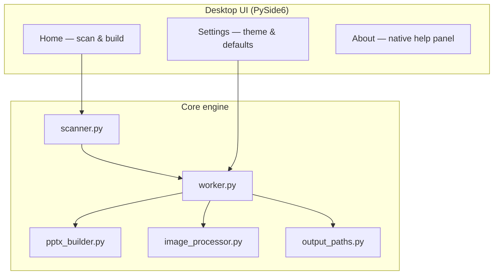
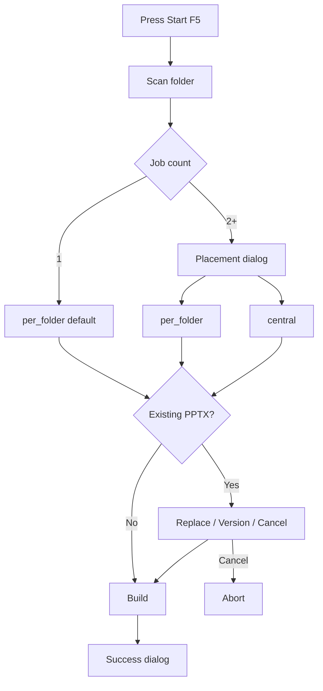

<div align="center">

**English** · [Persian](README.fa.md)


# Pics2PPT

**Turn photo folders into polished, RTL-ready PowerPoint reports — automatically.**

[](app/__init__.py)
[](LICENSE)
[](requirements.txt)
[](#system-requirements)
[](#running-tests)

</div>

---

## Table of Contents

<details open>
<summary><strong>Jump to section</strong></summary>

- [What is Pics2PPT?](#what-is-pics2ppt)
- [Why use it?](#why-use-it)
- [Screenshots & UI preview](#screenshots--ui-preview)
- [Feature Highlights](#feature-highlights)
- [Tech stack](#tech-stack)
- [Quick Start](#quick-start)
- [Portable EXE (single file)](#portable-exe-single-file)
- [How it works](#how-it-works)
- [Output placement & conflict handling](#output-placement--conflict-handling)
- [Folder layout patterns](#folder-layout-patterns)
- [Generated PowerPoint behavior](#generated-powerpoint-behavior)
- [Settings reference](#settings-reference)
- [Session vs persistent data](#session-vs-persistent-data)
- [Keyboard shortcuts](#keyboard-shortcuts)
- [Supported formats](#supported-formats)
- [Output location & naming](#output-location--naming)
- [System requirements](#system-requirements)
- [Development](#development)
- [Running tests](#running-tests)
- [Building from source](#building-from-source)
- [Project structure](#project-structure)
- [Troubleshooting](#troubleshooting)
- [Honest limitations](#honest-limitations)
- [FAQ](#faq)
- [Documentation index](#documentation-index)
- [Contributing](#contributing)
- [License & author](#license--author)

</details>

---

## What is Pics2PPT?

**Pics2PPT** is a desktop application (Python + PySide6) that scans folders of images and builds **bilingual PowerPoint (`.pptx`) reports** (Persian RTL or English LTR) with:

- a **2×2 image grid** per slide (up to 4 photos, aspect ratio preserved),
- optional **section divider slides** for multi-topic folders,
- **click-to-zoom** and **hover-to-zoom** detail slides in slideshow mode,
- configurable logos, footer text, compression, and themes,
- a **first-run language picker** and live UI language switch (Persian / English).

You select one input folder → the app detects the layout → it writes `.pptx` files into an output subfolder. For **multi-job project roots**, you choose whether outputs go **inside each unit folder** (manual-style) or **centrally** under one `Output_PPTX`.

> **Name meaning:** *Pics* (photos) → *PPT* (PowerPoint). The purpose is obvious from the name.

> [!NOTE]
> Pics2PPT runs **fully offline**. No telemetry, no cloud upload, no network calls during normal use.

---

## Why use it?

| Problem | Pics2PPT solution |
|--------|-------------------|
| Hundreds of field photos in nested folders | Auto-detects flat, grouped, and project-root layouts |
| Manual copy/paste into slides | Builds all decks in one batch |
| Persian RTL or English LTR decks | Slide language follows UI or a fixed FA/EN choice; B Nazanin / Calibri defaults |
| Heavy original JPEGs | Pillow compression + max dimension cap |
| Review meetings need zoom on a photo | Click/hover linked detail slides |
| Non-technical users on Windows | Single portable `Pics2PPT.exe`, no Python install |
| Teams want reports beside source photos | **Per-folder** output mode mirrors manual workflow |
| Re-running reports must not silently overwrite | **Replace / New version `(2)` / Cancel** conflict dialog |

---

## Screenshots & UI preview

> Placeholder until release screenshots are captured. Diagram below is **English UI** (ASCII-only so GitHub monospace stays aligned). Persian UI mirrors the same layout RTL.

```text
+---------------------------+----------------------------------+
| [Logo] Pics2PPT           | Home / Settings / About          |
| Photos -> PowerPoint      |                                  |
|---------------------------+----------------------------------|
| * Build Report            | Input folder            [Browse] |
|   Settings                | Footer text                      |
|   About & Help            | Logo L              Logo R       |
|                           | [Start F5] [Cancel] [Clear]      |
|                           | [########....] Progress          |
|                           | Log (compact)                    |
+---------------------------+----------------------------------+
```

| Tab | Purpose |
|-----|---------|
| **Home** | Select folder, footer/logos per run, start build, clear session inputs |
| **Settings** | Theme, UI/slide language, defaults, output folder name, PPTX quality |
| **About** | Version, bilingual help panel, folder pattern reference |

Assets: `assets/app_icon_256.png`, `assets/pics2ppt_logo.png`, `icon.ico`

---

## Feature Highlights

- **Smart folder scanner** — flat folders, person+topic trees, numbered sub-groups, mixed project roots
- **2×2 widescreen grid** — 16:9 slides (13.33″ × 7.5″), images centered with aspect ratio kept
- **Section dividers** — optional title slides between topical groups
- **Slideshow interactivity** — click zoom; hover zoom via OpenXML `hlinkHover` (python-pptx workaround)
- **Dual logos + footer** — optional left/right logos and custom footer line on every slide
- **Image polish** — optional shadow, border, filename captions below images (not in header)
- **Bilingual UI (FA + EN)** — first-run language picker, live switch, RTL/LTR layout
- **Separate slide language** — PPTX labels/font can follow UI or be fixed to Persian or English
- **Three UI themes** — dark cyan (default), dark purple, light
- **Output placement choice** — per-folder (manual-style) or central batch folder
- **Conflict-safe writes** — replace, versioned `(2)` files, or cancel before build
- **Persistent settings** — JSON in `%USERPROFILE%\.pics2ppt\settings.json` (`settings_version: 5`)
- **Session inputs cleared** — folder path, footer, logos reset each launch (privacy-friendly)
- **Success dialog** — open output folder, input folder, or first PPTX after build
- **Portable build** — one self-contained EXE (~50 MB with UPX)
- **59 automated tests** — scanner, output paths, PPTX XML, worker E2E, UI smoke, i18n FA+EN

---

## Tech stack

| Layer | Technology |
|-------|------------|
| Language | Python 3.11+ |
| Desktop UI | PySide6 (Qt6), bilingual FA/EN with RTL/LTR |
| Presentations | python-pptx + lxml (OpenXML) |
| Images | Pillow (PIL) |
| Packaging | PyInstaller 6.x — one-file EXE |
| Tests | pytest / unittest (59 tests) |
| Platform | Windows 10/11 (primary) |

---

## Quick Start

### Option A — Run from source (developers)

```bash
git clone https://github.com/YOUR_USER/Pics2PPT.git
cd Pics2PPT
python -m venv .venv
.venv\Scripts\activate        # Windows
pip install -r requirements.txt
python main.py
```

### Option B — Portable EXE (end users)

1. Download or build `dist\Pics2PPT.exe` (see [Portable EXE](#portable-exe-single-file)).
2. Double-click — no Python required.
3. On first Windows SmartScreen prompt for unsigned builds: **More info → Run anyway**.

### First report in 60 seconds

1. Open **Home** tab → **Select folder** (`Ctrl+O`) or drag a folder onto the path field.
2. (Optional) Set footer text and logo paths on the same page.
3. Press **Start** (`F5`).
4. If multiple jobs: choose **Inside each folder** or **Central**.
5. If existing PPTX files conflict: choose **Replace**, **New version `(2)`**, or **Cancel**.
6. Find output:
   - **Per-folder:** `<unit-folder>\Output_PPTX\<unit>.pptx`
   - **Central:** `<selected-root>\Output_PPTX\*.pptx`

---

## Portable EXE (single file)

```bat
build.bat
```

| Item | Detail |
|------|--------|
| Output | `dist\Pics2PPT.exe` |
| Type | **Single-file** PyInstaller bundle — not a source folder |
| Dependencies bundled | Python runtime, PySide6, python-pptx, Pillow, lxml |
| Compression | UPX when available (`tools\upx\` or PATH) |
| Icon | `icon.ico` embedded in EXE |
| Console | Hidden (`console=False`) |

The repository stays **source code**. The distributable artifact is **only** the EXE in `dist\` (gitignored).

---

## How it works




---

## Output placement & conflict handling

When the scanner finds **more than one job** (typical project-root pattern), Pics2PPT asks where to save files:

| Mode | English UI label | Result path |
|------|------------------|-------------|
| **Per-folder** | Inside each folder | `<job.source>\Output_PPTX\<job.name>.pptx` |
| **Central** | Central | `<selected-root>\Output_PPTX\<job.name>.pptx` |

Single-job runs default to **per-folder** (no dialog).



**Conflict dialog** (when target files already exist):

| Choice | Behavior |
|--------|----------|
| **Replace** | Overwrite existing `.pptx` |
| **New version** | Write `Name (2).pptx`, `Name (3).pptx`, … |
| **Cancel** | Abort build before writing |

> [!TIP]
> Use **New version** when you want to keep previous reports for comparison. Use **Central** when you need all decks in one folder for email or archive.

---

## Folder layout patterns

The scanner (`app/core/scanner.py`) supports four real-world patterns:

| # | Pattern | Example structure | Result |
|---|---------|-------------------|--------|
| 1 | **Flat** | `Topic/` → images only | 1 PPTX, no section dividers |
| 2 | **Person + topics** | `Person/topic_a/`, `Person/topic_b/`, optional images at person level | 1 grouped PPTX with sections |
| 3 | **Numbered groups** | `Visit/1/`, `Visit/2/` | Sections labeled "Group 1", "Group 2" (slide language) |
| 4 | **Project root** | Root contains multiple person/topic folders | **One PPTX per first-level subfolder** |

```text
Pattern 4 — project root
────────────────────────
ProjectRoot/
├── Person_A/          → Person_A.pptx
│   ├── topic_1/
│   └── topic_2/
├── Person_B/          → Person_B.pptx
│   └── photos...
├── FlatTopic/         → FlatTopic.pptx  (images directly inside)
└── Output_PPTX/       ← skipped during scan; all output written here
```

```text
Pattern 2 — person + topics
─────────────────────────────
Person/
├── IMG_001.jpg        → section "General images" (when topics also exist)
├── meetings/
├── site_visit/
└── Output_PPTX/
    └── Person.pptx
```

**Ignored during scan:** `Thumbs.db`, `.rar`/`.zip`, custom output folder name (default `Output_PPTX`).

Full diagrams: [docs/FOLDER_PATTERNS.md](docs/FOLDER_PATTERNS.md) · [Persian](docs/FOLDER_PATTERNS.fa.md)

---

## Generated PowerPoint behavior

| Aspect | Behavior |
|--------|----------|
| Slide size | Widescreen 16:9 (13.33 × 7.5 in) |
| Text direction | Follows **slide language**: RTL for Persian, LTR for English |
| Default font | Persian slides: B Nazanin; English slides: Calibri (overridable) |
| Grid | Up to 4 images per slide in 2×2 layout |
| Section slides | Inserted when `grouped=True` and dividers enabled |
| Section labels | From i18n catalog (`General images`, `Group N`, …) |
| Click zoom | Hyperlink from grid image → full detail slide |
| Hover zoom | Mouse-over action → same detail slide (requires zoom enabled) |
| Captions | Optional filename stem **below** each image |
| Logos | Left and/or right header logos if paths set |
| Footer | Custom footer text on every content slide |

---

## Settings reference

Stored in `%USERPROFILE%\.pics2ppt\settings.json` (legacy paths migrated automatically).

| Key | Default | Description |
|-----|---------|-------------|
| `settings_version` | `5` | Schema version |
| `ui_language` | OS locale or `fa` (migration) | UI language: `fa` · `en` |
| `slide_language_mode` | `same_as_ui` | `same_as_ui` or `fixed` |
| `slide_language` | follows UI or `fa` (migration) | PPTX labels/font when mode is `fixed` |
| `ui_language_confirmed` | `true` after first pick | First-run picker done; `false` only on brand-new install |
| `theme` | `dark_cyan` | `dark_cyan` · `dark_purple` · `light` |
| `font_size` | `medium` | UI typography scale |
| `output_folder_name` | `Output_PPTX` | Subfolder name for generated files |
| `footer_text` | `""` | Default footer (Home tab overrides per run) |
| `logo_left` / `logo_right` | `""` | Default logo paths (session-only on Home) |
| `jpeg_quality` | `75` | 40–95 |
| `max_dimension` | `1200` | Longest edge in px (600–2400) |
| `enable_section_dividers` | `true` | Topic divider slides |
| `enable_image_zoom` | `true` | Click-to-detail slides |
| `enable_hover_zoom` | `true` | Hover action (requires zoom) |
| `enable_image_shadow` | `true` | Drop shadow on images |
| `enable_image_border` | `true` | Border around images |
| `caption_from_filename` | `true` | Caption from file stem |
| `open_output_when_done` | `false` | Open output folder after build (also via success dialog) |

---

## Session vs persistent data

| Data | Persists across restarts? |
|------|---------------------------|
| Theme, JPEG quality, output folder name, zoom toggles, UI/slide language | **Yes** |
| Window geometry | **Yes** |
| First-run language confirmation (`ui_language.json`) | **Yes** — separate from session inputs |
| Last input folder, footer text, logo paths | **No** — cleared on every launch |
| Output placement choice | **No** — asked each multi-job build |

> [!IMPORTANT]
> Session inputs are intentionally **not saved** so shared PCs and field laptops do not leak previous project paths or footer text.

Use **Clear inputs** on the Home tab to reset folder, footer, and logos during a session.

---

## Keyboard shortcuts

| Key | Action |
|-----|--------|
| `Ctrl+O` | Choose input folder |
| `F5` | Start build (Home tab) |
| `Esc` | Cancel running build |
| `Ctrl+Q` | Quit application |
| `Ctrl+C` | Graceful exit when launched from terminal |

---

## Supported formats

| Type | Extensions | Notes |
|------|------------|-------|
| Input images | `.jpg`, `.jpeg`, `.png` | PNG with alpha converted to JPEG bytes |
| Output | `.pptx` | Microsoft PowerPoint 2007+ |
| Ignored | `.rar`, `.zip`, `Thumbs.db` | Skipped silently |

---

## Output location & naming

Output is always under an **`Output_PPTX`** (or custom name from Settings) subfolder — never in the parent of the selected root.

| Placement | Path pattern |
|-----------|--------------|
| **Per-folder** | `<job.source>\<Output_PPTX>\<job.name>.pptx` |
| **Central** | `<selected-root>\<Output_PPTX>\<job.name>.pptx` |

- One `.pptx` per detected job; file name = job name (folder name).
- Re-running with **Replace** overwrites; **New version** creates `(2)`, `(3)`, … siblings.
- The scanner **skips** the output folder name during input scan so generated files are not re-imported.

---

## System requirements

| Component | Requirement |
|-----------|-------------|
| OS | Windows 10/11 (primary target) |
| Python (source run) | 3.11+ |
| RAM | 4 GB minimum; 8 GB+ for large batches |
| Disk | ~100 MB for portable EXE; temp space during build |
| PowerPoint | Optional — for viewing; generation uses python-pptx |
| Persian font | **B Nazanin** recommended on system for best slide rendering |

---

## Development

```bash
pip install -r requirements.txt
python main.py
```

Architecture overview: [docs/ARCHITECTURE.md](docs/ARCHITECTURE.md)

---

## Running tests

```bash
python -m pytest tests/ -v
```

Or with unittest:

```bash
python -m unittest discover -s tests -p "test_*.py" -v
```

Coverage areas: scanner classification, output placement paths, PPTX OpenXML (hover links), worker end-to-end, settings roundtrip, themes, bootstrap SIGINT, PNG RGBA pipeline, help panel, i18n FA+EN.

**Current count: 59 passing tests.**

---

## Building from source

See [docs/BUILD.md](docs/BUILD.md) for PyInstaller spec details, UPX, and troubleshooting.

```bat
build.bat
```

---

## Project structure

```text
Pics2PPT/
├── main.py                 # Application entry
├── pics2ppt_entry.py       # PyInstaller entry
├── Pics2PPT.portable.spec  # One-file EXE spec
├── build.bat               # Portable build script
├── icon.ico                # Windows icon
├── assets/                 # Logo PNGs
├── app/
│   ├── bootstrap.py        # HiDPI, Ctrl+C handler
│   ├── resources.py        # Asset paths (dev + frozen)
│   ├── i18n/               # FA+EN catalogs, help content, locale detect
│   ├── core/               # scanner, builder, worker, output_paths, models
│   ├── services/           # settings.json + ui_language.json prefs
│   └── ui/                 # PySide6 windows, themes, language_dialog, help_panel
├── tests/                  # pytest/unittest suite (59 tests)
└── docs/                   # Extended documentation (EN + FA)
```

---

## Troubleshooting

| Symptom | Likely cause | Fix |
|---------|--------------|-----|
| "No images found" | Wrong folder level selected | Select folder that contains images directly or in subfolders |
| Empty PPTX | Only `.rar`/`.zip` or wrong extensions | Extract archives; use `.jpg`/`.png` |
| Missing Persian glyphs | B Nazanin not installed | Install font on Windows |
| Huge file size | `max_dimension` too high | Lower to 1200 or quality to 75 |
| Output in unexpected folder | Placement mode misunderstood | Re-read [Output placement](#output-placement--conflict-handling) |
| Hover zoom missing | Online/mobile viewer | Use desktop PowerPoint; click zoom still works |
| EXE won't start | AV quarantine | Allowlist or rebuild locally with `build.bat` |
| Settings not saving | Permissions on profile path | Check write access to `%USERPROFILE%\.pics2ppt\` |

More: [docs/FAQ.md](docs/FAQ.md) · [Persian](docs/FAQ.fa.md)

---

## Honest limitations

| Limitation | Detail |
|------------|--------|
| Windows-first | Built and tested on Windows; source may run elsewhere with manual setup |
| No macOS EXE | PyInstaller spec is Windows-oriented |
| 4 images per slide max | By design (2×2 grid) |
| No video/audio | Images only |
| No cloud sync | Manual folder copy |
| Filename captions | Stem only — no EXIF metadata captions |
| Hover zoom | Desktop PowerPoint only |

We document limits openly so expectations stay realistic.

---

## FAQ

**Why is output inside (or beside) my input folders?**  
So field teams keep photos and reports together. **Per-folder** mode mirrors manual filing; **Central** collects everything under one `Output_PPTX`.

**Can I change the output folder name?**  
Yes — Settings → `Output_PPTX` or custom name. The scanner skips that folder during input scan.

**Will it overwrite existing files?**  
Only if you choose **Replace** in the conflict dialog. **New version** keeps prior files.

**Do my folder path and footer persist after restart?**  
No. Only Settings-tab defaults and appearance persist. Home-tab inputs reset each launch.

**Will the language picker appear every time I open the app?**  
No. After the first choice it is stored in `%USERPROFILE%\.pics2ppt\ui_language.json` and is not asked again.

**Hover zoom does not work in PowerPoint Online.**  
Hover actions are a desktop PowerPoint feature; click zoom still works everywhere.

**Does it upload my photos anywhere?**  
No. Fully offline. No network calls.

More: [docs/FAQ.md](docs/FAQ.md) · [Persian](docs/FAQ.fa.md)

---

## Documentation index

| Document | English | Persian |
|----------|---------|---------|
| Main readme | [README.md](README.md) | [README.fa.md](README.fa.md) |
| User guide | [docs/USER_GUIDE.md](docs/USER_GUIDE.md) | [docs/USER_GUIDE.fa.md](docs/USER_GUIDE.fa.md) |
| Folder patterns | [docs/FOLDER_PATTERNS.md](docs/FOLDER_PATTERNS.md) | [docs/FOLDER_PATTERNS.fa.md](docs/FOLDER_PATTERNS.fa.md) |
| Architecture | [docs/ARCHITECTURE.md](docs/ARCHITECTURE.md) | [docs/ARCHITECTURE.fa.md](docs/ARCHITECTURE.fa.md) |
| Build & release | [docs/BUILD.md](docs/BUILD.md) | [docs/BUILD.fa.md](docs/BUILD.fa.md) |
| FAQ | [docs/FAQ.md](docs/FAQ.md) | [docs/FAQ.fa.md](docs/FAQ.fa.md) |
| Contributing | [CONTRIBUTING.md](CONTRIBUTING.md) | [CONTRIBUTING.fa.md](CONTRIBUTING.fa.md) |
| Changelog | [CHANGELOG.md](CHANGELOG.md) | [CHANGELOG.fa.md](CHANGELOG.fa.md) |
| Security | [SECURITY.md](SECURITY.md) | [SECURITY.fa.md](SECURITY.fa.md) |

---

## Contributing

Contributions welcome — bug reports, folder pattern edge cases, and UI polish.

Read [CONTRIBUTING.md](CONTRIBUTING.md) before opening a PR.

---

## License & author

MIT License — Copyright (c) 2026 **Ali Rashidi**

See [LICENSE](LICENSE) for full text.

---

<div align="center">

**Pics2PPT** — *Photos in. Presentations out.*

</div>
