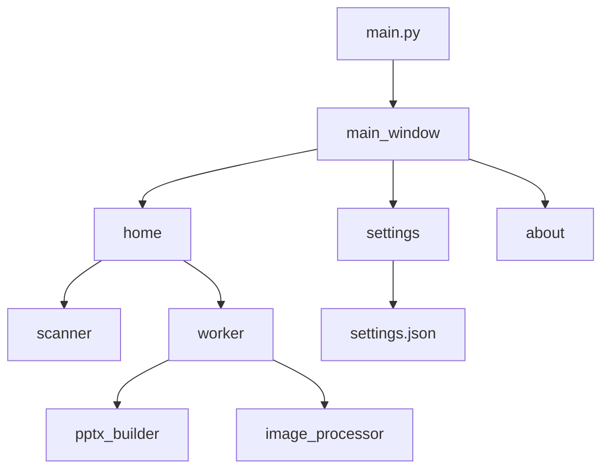

# معماری

[English](ARCHITECTURE.md) · [بازگشت به README](../README.fa.md)

نمای فنی **Pics2PPT** برای توسعه‌دهندگان.

---

## پشته فناوری

| لایه | فناوری |
|------|--------|
| زبان | Python 3.11+ |
| GUI | PySide6 |
| PPTX | python-pptx + lxml |
| تصویر | Pillow |
| بسته‌بندی | PyInstaller (EXE تک‌فایل) |
| تست | unittest / pytest — ۳۸ تست |

---

## لایه‌ها

---

## مسئولیت ماژول‌ها

| ماژول | نقش |
|-------|-----|
| `scanner.py` | طبقه‌بندی پوشه → `PresentationJob` |
| `worker.py` | ساخت در `QThread`، placement و conflict |
| `output_paths.py` | مسیر خروجی، نسخه `(۲)`، تشخیص تداخل |
| `pptx_builder.py` | RTL، شبکه ۲×۲، زوم |
| `image_processor.py` | فشرده‌سازی JPEG |
| `settings.py` | JSON در `.pics2ppt` |
| `theme.py` | سه تم QSS |
| `help_panel.py` | راهنمای RTL بومی (نه HTML) |
| `resources.py` | مسیر asset در dev/EXE |

---

## مدل رشته‌ای

| رشته | کار |
|------|-----|
| Main (Qt) | UI |
| Worker | ساخت PPTX + IO |

از worker به widget دست نزنید — فقط signal.

---

## زوم PPTX

هاور با OpenXML مستقیم (`hlinkHover`) — workaround برای python-pptx.

---

## مسیر dev در برابر EXE

| منبع | dev | PyInstaller |
|------|-----|-------------|
| لوگو | `assets/` | `_MEIPASS/assets/` |
| تنظیمات | `.pics2ppt` | همان |

---

## گسترش

| قابلیت جدید | فایل |
|-------------|------|
| الگوی پوشه | `scanner.py` + تست |
| چیدمان اسلاید | `pptx_builder.py` |
| تم UI | `theme.py` |
