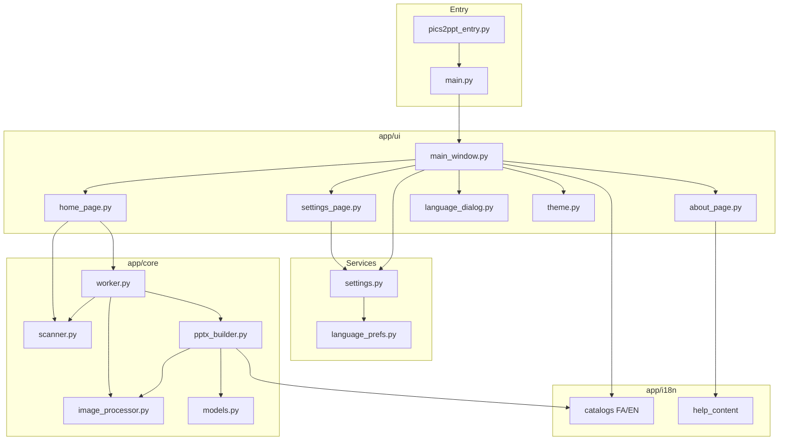
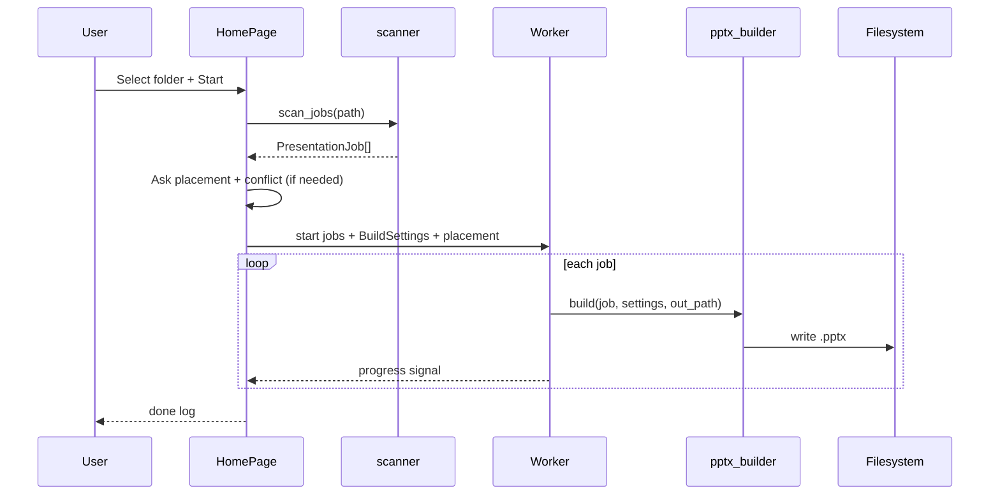

# Architecture

[Persian](ARCHITECTURE.fa.md) · [Back to README](../README.md)

Technical overview of **Pics2PPT** for developers and maintainers.

---

## Stack

| Layer | Technology |
|-------|------------|
| Language | Python 3.11+ |
| GUI | PySide6 (Qt6) |
| PPTX | python-pptx + lxml (OpenXML) |
| Images | Pillow (PIL) |
| Packaging | PyInstaller 6.x (one-file EXE) |
| Tests | unittest / pytest (59 tests) |

---

## Layer diagram



---

## Module responsibilities

### `app/core/scanner.py`

- Walks filesystem from user-selected root.
- Produces `list[PresentationJob]`.
- Each job: name, source path, `ImageGroup` list, `grouped` flag.
- Pure logic — no Qt dependency (easy to unit test).

### `app/core/worker.py`

- `QThread` worker for non-blocking UI.
- Iterates jobs, emits progress signals.
- Resolves output path via `output_paths.py` (central vs per-folder placement).
- Supports conflict modes: `replace` or versioned `(2)`, `(3)`, …
- Supports cancel flag between jobs.

### `app/core/output_paths.py`

- `job_output_file()` — placement-aware target paths.
- `find_existing_outputs()` — pre-build conflict detection.
- `resolve_output_path()` — version suffix allocation.

### `app/core/pptx_builder.py`

- Builds `Presentation` from `PresentationJob` + `BuildSettings`.
- Layout constants for 16:9 grid (header, 2×2, footer bands).
- Paragraph direction from slide language (RTL Persian / LTR English).
- Click hyperlinks + hover `hlinkHover` OpenXML injection.
- Section divider slides when grouped; labels via `t_slide()`.

### `app/core/image_processor.py`

- Resize to `max_dimension`.
- JPEG re-encode at `jpeg_quality`.
- PNG RGBA → RGB JPEG bytes.

### `app/core/models.py`

- `BuildSettings` dataclass with `from_dict()` clamps.
- Includes `ui_language` and `slide_language`; font defaults follow slide language.

### `app/i18n/`

- `catalog_fa.py` / `catalog_en.py` — UI, worker, and PPTX string catalogs.
- `t()` / `t_slide()` / `set_ui_language()` / `set_build_slide_language()`.
- `help_content.py` — structured About help sections.
- `locale_detect.py` — OS locale → suggested `fa` or `en`.

### `app/services/settings.py`

- JSON at `%USERPROFILE%\.pics2ppt\settings.json` (schema v5).
- Language keys: `ui_language`, `slide_language_mode`, `slide_language`, `ui_language_confirmed`.
- Migrates legacy `.slidereport`, `.gen_powerpoint`.
- Window geometry persistence.
- Clears session input keys (`last_input_dir`, footer, logos) on load/save.

### `app/services/language_prefs.py`

- Durable first-run choice in `ui_language.json` (survives settings rewrites).

### `app/ui/`

- Bilingual UI with live RTL/LTR layout direction.
- First-run `language_dialog.py`; three themes via dynamic QSS (`theme.py`).
- Native help panel (`help_panel.py`) — FA/EN, not HTML.

### `app/bootstrap.py`

- HiDPI configuration.
- SIGINT handler for clean Ctrl+C from terminal.

### `app/resources.py`

- Resolves `assets/` and `icon.ico` in dev vs PyInstaller `_MEIPASS`.

---

## Data flow (one build)



---

## Threading model

| Thread | Work |
|--------|------|
| Main (Qt) | UI events, signals |
| Worker (`QThread`) | Scan already done on main; build + IO on worker |

Never touch Qt widgets from worker thread — signals only.

---

## PPTX zoom implementation note

python-pptx does not fully expose hover actions. Pics2PPT writes `p:oleAction` / `hlinkHover` elements directly via lxml after shape creation. Covered by tests in `test_comprehensive.py`.

---

## Frozen vs dev paths

| Resource | Dev | PyInstaller |
|----------|-----|-------------|
| Logo PNG | `assets/app_icon_256.png` | `_MEIPASS/assets/` |
| Icon | `icon.ico` | `_MEIPASS/icon.ico` |
| Settings | `%USERPROFILE%\.pics2ppt` | same |

---

## Extension points

| Want to add… | Start here |
|--------------|------------|
| New folder pattern | `scanner.py` + tests in `test_comprehensive.py` |
| New slide layout | `pptx_builder.py` layout constants |
| New UI theme | `theme.py` `THEME_PALETTES` |
| CLI mode | New entry script calling `scan_project_folders` + builder |

---

## Dependencies graph

```text
PySide6 ──► Qt6 DLLs (bundled in EXE)
python-pptx ──► lxml
Pillow ──► image codecs (stdlib + zlib)
pyinstaller ──► build-time only
```

---

## Related

- [BUILD.md](BUILD.md) — PyInstaller spec
- [FOLDER_PATTERNS.md](FOLDER_PATTERNS.md) — scanner behavior
- [CONTRIBUTING.md](../CONTRIBUTING.md)
