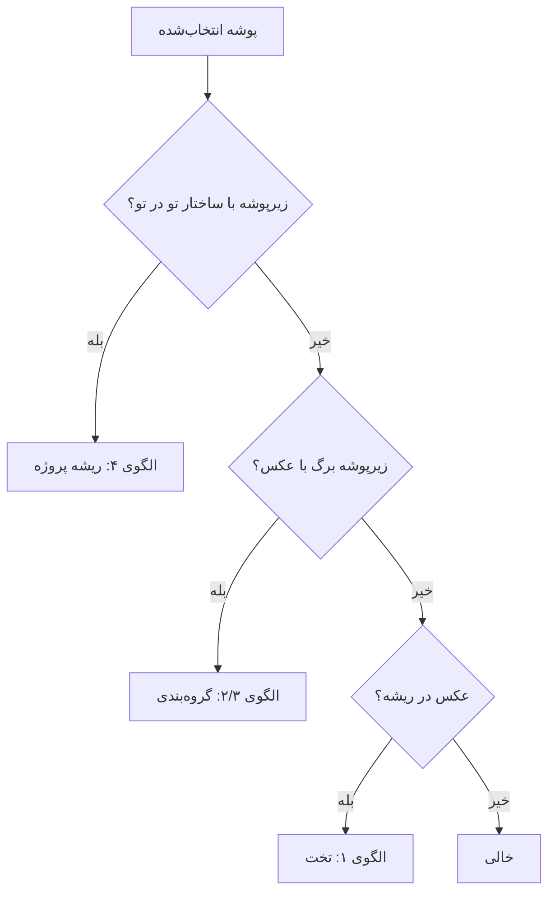

# الگوهای ساختار پوشه

[English](FOLDER_PATTERNS.md) · [بازگشت به README](../README.fa.md)

مرجع نحوهٔ طبقه‌بندی پوشه‌ها توسط **Pics2PPT**.

---

## جریان تصمیم



---

## الگوی ۱ — پوشه تخت

```text
SiteVisit/
├── photo_001.jpg
└── photo_002.jpg

خروجی → SiteVisit/Output_PPTX/SiteVisit.pptx
بدون جداکننده بخش
```

---

## الگوی ۲ — شخص + موضوعات

```text
Consultant_A/
├── overview.jpg       ← «تصاویر کلی»
├── meetings/
└── site_photos/

خروجی → Consultant_A.pptx با بخش‌بندی
```

---

## الگوی ۳ — گروه شماره‌دار

```text
FieldTrip/
├── 1/
└── 2/

برچسب → «گروه ۱»، «گروه ۲»
```

---

## الگوی ۴ — ریشه پروژه

```text
AnnualReport/
├── Team_Alpha/   → Team_Alpha.pptx
├── Team_Beta/    → Team_Beta.pptx
└── Output_PPTX/  ← نادیده
```

---

## قوانین نادیده گرفتن

| مورد | رفتار |
|------|--------|
| `Output_PPTX` | اسکن نمی‌شود |
| `Thumbs.db` | نادیده |
| `.rar`, `.zip` | نادیده |

---

## ترتیب عکس‌ها

مرتب‌سازی **الفبایی** نام فایل.

---

## کد

`app/core/scanner.py` — `scan_project_folders()`, `make_flat_job()`, `make_grouped_job()`

---

## محل خروجی (پس از اسکن)

اسکنر فقط **تعداد job** را تعیین می‌کند. **محل** `.pptx` هنگام ساخت انتخاب می‌شود (اگر job > 1):

| حالت | مسیر |
|------|------|
| **داخل هر پوشه** | `<job.source>/Output_PPTX/<job.name>.pptx` |
| **یکجا** | `<ریشه>/Output_PPTX/<job.name>.pptx` |

تک-job به‌طور پیش‌فرض داخل همان پوشه.

[USER_GUIDE.fa.md](USER_GUIDE.fa.md) · [README](../README.fa.md#محل-خروجی-و-مدیریت-تداخل)
