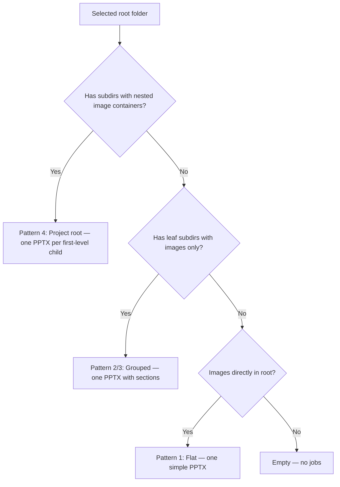
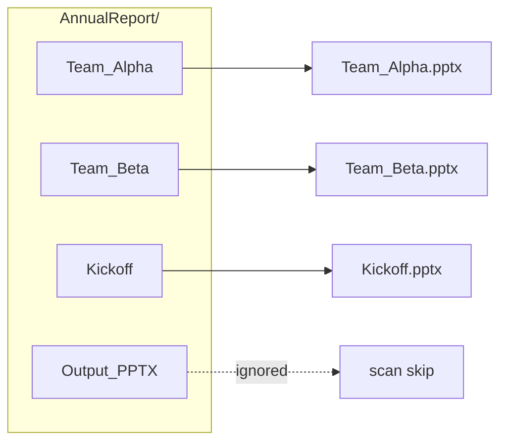

# Folder Layout Patterns

[Persian](FOLDER_PATTERNS.fa.md) · [Back to README](../README.md)

Reference for how **Pics2PPT** classifies directories into presentation jobs.

---

## Decision flow



---

## Pattern 1 — Flat folder

**When:** Images sit directly in the selected folder; no relevant subfolders.

```text
SiteVisit/
├── photo_001.jpg
├── photo_002.jpg
└── photo_003.png

Output → SiteVisit/Output_PPTX/SiteVisit.pptx
Sections → none (grouped=false)
```

---

## Pattern 2 — Person + topic subfolders

**When:** One entity folder contains multiple topic subfolders. Optional images at entity level.

```text
Consultant_A/
├── overview_01.jpg          ← "General images" section (if topics exist)
├── meetings/
│   ├── m1.jpg
│   └── m2.jpg
└── site_photos/
    └── s1.jpg

Output → Consultant_A/Output_PPTX/Consultant_A.pptx
Sections → General images, meetings, site_photos
Divider slides → yes (when enabled)
```

---

## Pattern 3 — Numbered group subfolders

**When:** Subfolder names are digits (`1`, `2`, …) or nested numeric groups.

```text
FieldTrip/
├── 1/
│   ├── a.jpg
│   └── b.jpg
└── 2/
    └── c.jpg

Section labels → "Group 1", "Group 2" (English slide language)
```

Nested numeric example:

```text
Branch/
└── 3/
    ├── 1/  → section "Group 3 — Group 1"
    └── 2/  → section "Group 3 — Group 2"
```

---

## Pattern 4 — Project root

**When:** Selected folder contains **multiple** first-level units (each may be flat or grouped).

```text
AnnualReport/
├── Team_Alpha/        → grouped job → Team_Alpha.pptx
├── Team_Beta/         → flat job    → Team_Beta.pptx
├── Kickoff/           → flat job    → Kickoff.pptx
└── Output_PPTX/       → SKIPPED (never scanned as input)

Output → AnnualReport/Output_PPTX/*.pptx (multiple files)
```



---

## Skip rules

| Item | Behavior |
|------|----------|
| `Output_PPTX` (default name) | Skipped as input subfolder |
| Custom `output_folder_name` from settings | Also skipped |
| `Thumbs.db` | Ignored file |
| `.rar`, `.zip` | Ignored extension |
| Subfolder with no images anywhere | Skipped (no job) |

---

## Image ordering

Within each section, images sort **alphabetically** by filename (case-insensitive).

---

## Slide packing

- Up to **4 images per slide** (2×2 grid).
- Remaining images continue on next slides within same section.
- Section divider slide inserted before each section when `grouped=True` and dividers enabled.

---

## Code reference

Implementation: `app/core/scanner.py`

| Function | Role |
|----------|------|
| `scan_project_folders()` | Top-level classifier |
| `make_flat_job()` | Pattern 1 |
| `make_grouped_job()` | Patterns 2 & 3 |
| `is_container()` | Detects nested structure |

---

## Output placement (after scan)

The scanner only decides **how many jobs** exist. **Where** `.pptx` files land is chosen at build time (when job count > 1):

| Mode | Path |
|------|------|
| **Per-folder** | `<job.source>/Output_PPTX/<job.name>.pptx` |
| **Central** | `<selected-root>/Output_PPTX/<job.name>.pptx` |

Single-job scans default to per-folder without asking.

See [USER_GUIDE.md](USER_GUIDE.md) · [README output section](../README.md#output-placement--conflict-handling)
