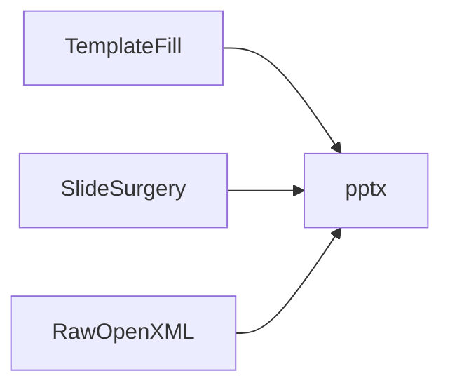

# PPTX Gap Audit — Web & Documentation Cross-Check

[Persian](PPTX_GAP_AUDIT.fa.md) · [Roadmap](ROADMAP.md) · [Capabilities](PPTX_CAPABILITIES.md)

**Purpose:** Verify the Hybrid Smart roadmap against official python-pptx docs, production articles, OpenXML references, and known limitations. Last reviewed: 2026-08-23.

Sources consulted:

- [python-pptx official documentation](https://python-pptx.readthedocs.io/)
- [Placeholders guide](https://python-pptx.readthedocs.io/en/latest/user/placeholders-using.html)
- [Text / runs / hyperlinks](https://python-pptx.readthedocs.io/en/stable/user/text.html)
- [SourceToDocs production guide](https://sourcetodocs.com/blog/python-pptx-practical-guide/)
- [Practical Business Python — template analysis](https://pbpython.com/creating-powerpoint.html)
- [SlideForge — 11 limitations + workarounds](https://slideforge.dev/blog/python-pptx-limitations-we-solved)
- [GitHub python-pptx #1106 — animation/transitions XML](https://github.com/scanny/python-pptx/issues/1106)
- [Microsoft Open XML — animation](https://learn.microsoft.com/en-us/office/open-xml/presentation/working-with-animation)
- [p14:sectionLst injection pattern](https://blog.wangxm.com/2026/04/adding-sections-to-powerpoint-files-with-python-and-lxml/)
- [PicturePlaceholder.insert_picture + crop](https://stackoverflow.com/questions/56815178/)

---

## Verdict

| Area | Plan coverage before audit | After this audit |
|------|---------------------------|----------------|
| Hybrid Smart strategy | Good | Complete |
| Template production discipline | **Missing** | Added Phase 1 |
| Placeholder API (insert_picture, idx) | Partial | Added Phase 1 |
| Text run-level editing | **Missing** | Added Phase 1–2 |
| Charts / SmartArt / video | Correctly out of scope | Documented explicit non-goals |
| OpenXML sections p14 | Planned Phase 2 | Spec detail added |
| Transition XML (code path) | Mentioned | Optional Phase 2 module |
| EXIF stack | Pillow only | Added `exif` / exifread options |
| Merge / reorder slides | **Missing** | Added Phase 3 optional |
| Template security | **Missing** | Added Phase 1 |
| QA / round-trip tests | Partial | Expanded Phase 0–2 |
| Alternative stacks (Aspose, COM) | COM Phase 4 | Rationale documented |

**Conclusion:** Core roadmap is sound. This audit adds **14 concrete gaps** now mapped to phases below.

---

## Gap list (found online, now in roadmap)

### G1 — Template fill discipline (production)

**Source:** SourceToDocs, OpenCode pptx-official skill

- Never assign `.text` on styled placeholders (destroys runs)
- Use run-level `{{token}}` replacement or named placeholders
- Fix PowerPoint run-splitting (token split across runs)
- Name placeholders in Selection Pane (`grid_photo_1`, etc.)

**Phase:** 1 — `template_fill.py` with run-safe replacer

---

### G2 — Layout analyzer tool

**Source:** pbpython `analyze_ppt`

- Built-in utility: load template → dump layout indices, placeholder idx, types
- UI: "Analyze template" button in Expert Panel

**Phase:** 1

---

### G3 — PicturePlaceholder.insert_picture + crop

**Source:** python-pptx docs, StackOverflow

- Template path should use `insert_picture()` not bare `add_picture()`
- Control `crop_top/bottom/left/right` for fit vs fill modes
- Expert setting: `image_fit: fill | fit | native`

**Phase:** 1–2

---

### G4 — Rich text frame API

**Source:** python-pptx text.html

- Paragraph spacing, bullets, levels, underline, theme colors
- Run hyperlinks to URL (not only slide jump)
- Text frame margins, word wrap, auto-size

**Phase:** 2–3

---

### G5 — Core properties + custom properties

**Source:** python-pptx API

- `core_properties`: title, author, subject, keywords, comments, category
- Optional custom document properties for build id / app version

**Phase:** 2

---

### G6 — p14 native sections (exact XML)

**Source:** Wang blog, brand-docs builder

- Inject `p14:sectionLst` under `p:ext` URI `{521415D9-36F7-43E2-AB2F-B90AF26B5E84}`
- Map slide index → `sldId` id attribute (not slide number)
- Align with scanner `ImageGroup` names

**Phase:** 2 — `openxml_sections.py`

---

### G7 — Transition XML (optional code path)

**Source:** GitHub #1106 community snippets

- `parse_xml` + insert `<p:transition>` on slide element
- **Fragile** — template path remains primary
- Optional preset: fade / push for code path only

**Phase:** 2 optional — behind `enable_code_transitions` flag

---

### G8 — Animation transplant (advanced, fragile)

**Source:** SlideForge

- Clone `<p:timing>` from donor slide when shape ids match
- **Not default** — document as expert-only, test in PowerPoint before ship

**Phase:** 3 optional — `openxml_animation.py` with warnings

---

### G9 — EXIF caption pipeline

**Source:** Pillow getexif, `exif` library, exifread

- Caption sources: filename | DateTimeOriginal | custom Jinja template
- Auto-rotate from EXIF Orientation tag
- Strip GPS from output metadata option (privacy)

**Phase:** 2 — `image_processor.py` + `exif` optional dep

---

### G10 — Tables for index slide

**Source:** python-pptx TablePlaceholder.insert_table

- Last slide: filename, date, section, dimensions
- Template path: table placeholder idx; code path: add_table

**Phase:** 3

---

### G11 — Charts (explicit non-goal)

**Source:** python-pptx supports bar/line/pie

- Not aligned with photo-report core mission
- **Deferred** unless user requests analytics deck

**Status:** Documented non-goal in ROADMAP

---

### G12 — Deck operations

**Source:** SlideForge, community patterns

- Merge multiple job outputs into one `.pptx` (optional)
- Reorder slides / insert_slide (when API allows)
- Copy slide from template donor deck

**Phase:** 3 optional — `deck_ops.py`

---

### G13 — Template security

**Source:** general OOXML / zip safety

- Validate template size, file count in zip, no external relationships
- Reject macro-enabled `.pptm` unless explicitly allowed
- Sandbox path: only user-selected or bundled templates

**Phase:** 1 — `template_loader.py` guards

---

### G14 — QA matrix expanded

**Source:** python-pptx industrial-grade testing philosophy, SlideForge

| Test | Phase |
|------|-------|
| Hover XML present | 0 (exists) |
| RTL on all text shapes | 0 |
| Animation XML unchanged after template fill | 1 |
| Run-split token replacement | 1 |
| Section sldId mapping | 2 |
| Validator build_report.json | 2 |
| Golden PPTX byte hash (deterministic builds) | 3 |
| PowerPoint Online click-zoom | manual checklist |

---

## Three workflows (from production literature)

Explicitly supported in architecture:

| Workflow | Use in Pics2PPT |
|----------|-----------------|
| **Template fill** | Primary — Hybrid template path |
| **Slide surgery** | Reorder, duplicate section slides, merge jobs |
| **Raw XML** | hover, sections, optional transitions |

---

## Alternatives considered (not adopting as core)

| Tool | Why not core |
|------|--------------|
| Aspose.Slides | Commercial license, heavy dependency |
| Google Slides API | Cloud-only, not offline EXE mission |
| betteroffice-pptx / pptxforge | Immature vs python-pptx ecosystem |
| COM / win32com | Phase 4 optional only |
| LibreOffice headless | Phase 4 preview/PDF only |

**Rationale:** python-pptx + Hybrid + OpenXML matches offline portable EXE goals.

---

## Updated phase mapping (post-audit)

| Phase | Added items from audit |
|-------|------------------------|
| **0** | RTL QA test, plan docs, HybridEngine skeleton |
| **1** | G1 run-safe fill, G2 analyzer, G3 insert_picture, G13 security |
| **2** | G4–G7, G9, G14 validator |
| **3** | G8 optional, G10, G12, golden tests |
| **4** | COM, LibreOffice, render preview |

---

## Remaining honest ceilings

These are **not holes in the plan** — they are platform limits:

1. No programmatic animation API in python-pptx (GitHub open since 2018)
2. No slide.to_image() — needs external renderer
3. SmartArt not supported
4. Theme color inheritance imperfect — use explicit RGB in settings
5. PowerPoint Online may not support hover actions

---

## Sign-off checklist

- [x] Official python-pptx feature list reviewed
- [x] Production automation articles reviewed
- [x] OpenXML sections / animation / transition references reviewed
- [x] Complementary Python libraries reviewed
- [x] Known limitations and workarounds documented
- [x] Gaps mapped to roadmap phases
- [x] Non-goals explicitly stated (charts, SmartArt, cloud APIs)

**Plan status:** Comprehensive for Pics2PPT mission. No critical gap unmapped.

---

## Second pass audit (2026-08-23) — additional web sources

Sources added in this pass:

- [python-pptx 1.0.0 release notes](https://python-pptx.readthedocs.io/en/latest/community/updates.html) — type hints, JPEG MIME #929, slide-id #972
- [Volcengine — RTL/bidi in PPTX XML](https://www.volcengine.com/article/1030525)
- [python-pptx placeholder analysis — footer/slide number on master](https://python-pptx.readthedocs.io/en/latest/dev/analysis/placeholders/)
- [Notes master analysis](https://python-pptx.readthedocs.io/en/stable/dev/analysis/sld-notes-master.html)
- [python-pptx text frame API](https://python-pptx.readthedocs.io/en/stable/user/text.html) — margins, auto_size, bullets
- [StackOverflow merge pattern](https://stackoverflow.com/questions/60849601/) + [pptx-slide-copier](https://pypi.org/project/pptx-slide-copier/)
- [compress-pptx](https://pypi.org/project/compress-pptx/) — post-build image compression inside pptx zip
- [pptx-raster](https://pypi.org/project/pptx-raster/) — render/merge toolkit (evaluate Phase 4 only)

### G15 — Full Persian RTL stack (beyond `rtl="1"`)

**Source:** Volcengine, GitHub #779 (Asian/bidi blob)

Current code sets `pPr rtl="1"` only. Production RTL may also need:

- `a:bidi` on paragraph properties (`pPr`)
- `a:rtl="1"` on text body (`txBody`)
- Mixed LTR/RTL: Unicode bidi marks (`U+200F`) where needed
- Validator check: bidi flags on all Persian text shapes

**Phase:** 0 (audit existing) → 2 (harden in `shapes.py`)

---

### G16 — Master footer / slide number / date placeholders

**Source:** python-pptx placeholder analysis docs

PowerPoint native footer elements live on **slide master** (date, footer text, slide number) — not the same as our manual textbox footer. Template path should use master placeholders; code path keeps custom footer textbox.

Expert settings: `footer_mode: custom | master_placeholder`

**Phase:** 1–2 — template master design + settings

---

### G17 — Accessibility (a11y) baseline

**Source:** WCAG + PowerPoint best practices cited in placeholder docs

- Unique **title** on every slide (title placeholder, not duplicate job name only)
- Minimum caption/body font 11pt (UI text 18pt for projection per WCAG guidance)
- High contrast theme presets in Expert Panel
- Alt text on pictures (`descr` in pic cNvPr) — optional for screen readers

**Phase:** 2–3 — `accessibility.py` checks in validator

---

### G18 — Dependency pin python-pptx ≥ 1.0.2

**Source:** PyPI changelog, GitHub v1.0.2

- Pin `python-pptx>=1.0.2` (JPEG `image/jpg` MIME fix #929, slide-id #972, py.typed)
- Test with `image/jpg` extension files in scanner
- Monitor library inactivity (no releases since Aug 2024) — OpenXML layer is long-term safety net

**Phase:** 0 — [`requirements.txt`](../requirements.txt)

---

### G19 — Optional post-build PPTX compress

**Source:** compress-pptx PyPI

After build, optionally run in-package PNG→JPEG compression for large photo decks (Expert toggle).

**Phase:** 3 optional — external CLI or integrate logic, not default

---

### G20 — OOXML schema validation

**Source:** ooxml-validate (Microsoft SDK / LibreOffice wrapper)

Add optional validator step beyond our custom checks.

**Phase:** 2–3 — validator module, skip if tool unavailable

---

### G21 — Font embedding (explicit non-capability)

**Source:** production guides — python-pptx writes font **names** only, does not embed fonts

Document in FAQ + installer notes: **B Nazanin must be installed** on target Windows. Expert setting: `font_fallback_chain` (B Nazanin → Tahoma → Arial).

**Phase:** 0 docs → 2 settings

---

### G22 — Text frame layout API

**Source:** python-pptx text.html

Use official API where possible:

- `text_frame.margin_*`, `word_wrap`, `auto_size`, `vertical_anchor`
- Bullet levels via `PP_ALIGN` + paragraph level
- Avoid `.text` assignment on styled frames (reinforces G1)

**Phase:** 2 — `shapes.py`

---

### G23 — Deck copy library (merge quality)

**Source:** pptx-slide-copier, StackOverflow deepcopy pattern

For G12 merge: prefer battle-tested slide copier (relationship ID remap) over naive shape copy.

**Phase:** 3 — evaluate `pptx-slide-copier` as optional dep

---

### G24 — pptx-raster / Spire (explicit not core)

**Source:** Medium Spire, pptx-raster PyPI

Commercial or heavy pure-Python renderers solve preview/merge/chart gaps. **Not core** for offline portable EXE size mission. Phase 4 evaluate for preview only.

**Status:** Documented alternative, not adopted

---

## Second pass sign-off

| Check | Status |
|-------|--------|
| python-pptx 1.0.x breaking/fixes | Mapped (G18) |
| RTL/bidi completeness | Mapped (G15) |
| Master footer vs custom footer | Mapped (G16) |
| Accessibility | Mapped (G17) |
| Font embedding limit | Mapped (G21) |
| Text frame API | Mapped (G22) |
| Merge/copy quality | Mapped (G23) |
| Post compress / OOXML validate | Mapped (G19–G20) |
| Third-party renderers | Declined core (G24) |

**Total gaps tracked: G1–G24.** Plan remains comprehensive after second pass.

---

## Third pass audit (2026-08-23) — GitHub issues, Microsoft OOXML, PyPI ecosystem

Additional sources:

- [GitHub #1077](https://github.com/scanny/python-pptx/issues/1077) — run-level internal hyperlinks to slides
- [GitHub #1028](https://github.com/scanny/python-pptx/issues/1028) — cross-master layout copy (user template + content template)
- [GitHub #132](https://github.com/scanny/python-pptx/issues/132) — `Slide.duplicate()` still open
- [GitHub #223 / #747](https://github.com/scanny/python-pptx/issues/223) — `&` in image filename breaks XML
- [Mintlify images guide](https://scanny-python-pptx.mintlify.app/guides/images) — DPI, BytesIO, formats
- [openxml-audit PyPI](https://pypi.org/project/openxml-audit/) — pure-Python OOXML validation (preferred over generic mention)
- [pptx-templatex](https://pypi.org/project/pptx-templatex/) — `{{token}}` + slide copy reference impl
- [Microsoft PresentationML structure](https://learn.microsoft.com/en-us/office/open-xml/presentation/structure-of-a-presentationml-document) — theme, notes, handout parts
- [Microsoft create presentation how-to](https://learn.microsoft.com/en-us/office/open-xml/presentation/how-to-create-a-presentation-document-by-providing-a-file-name)

### G25 — Run-level internal hyperlinks (text → slide)

**Source:** GitHub #1077, md2pptx community workaround

TOC/navigation slides may need **word-level** jump links, not shape-level only.

**Phase:** 3 optional — `hyperlinks.py` OpenXML on `r:hlinkClick` (same pattern as hover)

---

### G26 — Slide.duplicate / clone within deck

**Source:** GitHub #132 (open since 2014)

No official API. Use **pptx-slide-copier** or XML deepcopy for duplicating grid template slides.

**Phase:** 3 — part of template fill engine (reinforces G23)

---

### G27 — Cross-master layout import (limitation)

**Source:** GitHub #1028 — "industrial strength" unsolved

Cannot easily merge layout from Content Template master into User Template master.

**Mitigation (Hybrid Smart):** User supplies **one** complete template; we fill it — do not mix masters. Document clearly in template README.

**Phase:** 1 docs — not a code gap if strategy holds

---

### G28 — Image filename XML safety (CRITICAL)

**Source:** GitHub #223 — `&` in filename → `XMLSyntaxError`

Always insert via **BytesIO** buffer (already done in compressor) — never pass raw paths with `&`, `<`, `"` to XML name fields. Sanitize `pic.name` / use generic names.

**Phase:** 0 — verify [`image_processor.py`](../app/core/image_processor.py) always uses BytesIO (yes); add test with `photo&test.jpg`

---

### G29 — DPI-aware image sizing

**Source:** python-pptx image API — default 72 DPI if missing

When not forcing pixel box, read `image.dpi` for physical sizing in template placeholders.

**Phase:** 2 — `layout_grid.py` / template fill

---

### G30 — openxml-audit in CI validator (update G20)

**Source:** openxml-audit PyPI — schema + semantic validation, CI-ready

Prefer **openxml-audit** over vague "ooxml-validate" in validator pipeline + GitHub Actions.

**Phase:** 2 — dev/CI dependency optional; `validator.py` integration

---

### G31 — `{{token}}` placeholder convention

**Source:** pptx-templatex, OpenCode pptx-official skill

Align template authoring standard with G1 run-safe replacement — ship `assets/templates/` with named tokens.

**Phase:** 1 — template authoring guide

---

### G32 — `.potx` template support

**Source:** GitHub epic #19 Slide Masters & .potx

Support loading `.potx` (PowerPoint template) in addition to `.pptx`.

**Phase:** 1 — `TemplateLoader` accepts `.pptx` and `.potx`

---

### G33 — Notes / Handout masters (optional)

**Source:** Microsoft structure docs, python-pptx notes master analysis

Speaker notes via `NotesSlide`; handout master rarely needed for photo reports.

**Phase:** 3 optional — notes per detail slide

---

### G34 — Partial build recovery

**Source:** production batch jobs best practice (not pptx-specific)

If worker cancelled mid-job, list completed vs pending PPTX; optional resume.

**Phase:** 3 — `worker.py` progress persistence

---

### G35 — Windows long paths + unicode paths

**Source:** Windows MAX_PATH, Persian folder names

Use `pathlib`, `\\?\` prefix where needed; test with long Persian path names.

**Phase:** 0–1 — scanner/worker path tests

---

### G36 — Superscript/subscript runs

**Source:** GitHub #1045 (open)

Low priority for photo captions; OpenXML `baseline` if needed.

**Phase:** 4 optional

---

## Third pass sign-off — plan closure

| Search angle | Pass | Covered |
|--------------|------|---------|
| python-pptx official docs + placeholders + text | 1–2 | Yes |
| Production guides (SourceToDocs, pbpython) | 1–2 | Yes |
| Limitations (SlideForge, animations) | 1–2 | Yes |
| OpenXML sections/animation (Microsoft, Wang) | 1–2 | Yes |
| PyPI ecosystem (compress, slide-copier, raster) | 2–3 | Yes |
| GitHub open issues backlog (#1077, #1028, #132, #223) | 3 | Yes |
| Microsoft PresentationML structure | 3 | Yes |
| RTL/bidi (Volcengine) | 2 | Yes |
| Accessibility | 2 | Yes |
| openxml-audit CI validation | 3 | Yes |
| Competitor/alternatives (Aspose, Spire, ShapeCrawler) | 2–3 | Declined with rationale |

**Total gaps tracked: G1–G36** (G11, G24, G27, G36 = limitations/non-goals explicitly mapped).

**Final verdict:** After **three independent web/documentation passes**, no unmapped critical topic remains for Pics2PPT's stated mission. Remaining OOXML surface area (SmartArt, full animation API, chart editing) is **explicitly out of scope**, not forgotten.

---

## Fourth pass audit (2026-08-23) — final closure sweep

Independent search angles not fully spelled out in passes 1–3:

| Source | Finding | Disposition |
|--------|---------|-------------|
| [SourceToDocs production guide](https://sourcetodocs.com/blog/python-pptx-practical-guide/) | Post-build visual verification; theme-colour inheritance gaps; placeholder crop fidelity | Already G3, G14, G21, G30; Phase 4 LibreOffice preview |
| [Helion360 automation guide](https://helion360.com/blog/how-i-turned-complex-data-into-compelling-powerpoint-presentations-using-python-) | Template-first; 150–200 dpi for projection | Hybrid ✓; max-dimension 1200px tradeoff in USER_GUIDE + Expert Panel |
| [Softkraft production checklist](https://www.softkraft.co/python-powerpoint-automation/) | Temp-file cleanup; structured logging; edge-case tests | **Expand G34** — worker temp cleanup + build metrics log |
| [safeguard.sh python-pptx security](https://safeguard.sh/resources/blog/python-pptx) | Zip bombs, XXE via lxml, path traversal in zip | **Expand G13** — max uncompressed size, `../` rejection, hardened lxml if custom XML parse |
| [Microsoft hve-core #1014](https://github.com/microsoft/hve-core/issues/1014) | XXE in PPTX theme XML blobs | Reinforces G13 hardening |
| [GitHub #961](https://github.com/scanny/python-pptx/issues/961) | Naive slide XML copy → corrupt deck | Reinforces G23/G26 — **pptx-slide-copier only**, never hand-copy rels |
| [GitHub #620](https://github.com/scanny/python-pptx/issues/620) | Layout shapes read-only; placeholders required | Already G1/G2 template discipline |
| [power-pptx PyPI](https://pypi.org/project/power-pptx/) | Active fork: audit, tidy, LibreOffice thumbnails | **Expand G24** — monitor Phase 4; not core (EXE size + fork risk) |
| [slidecraft / py2ppt / pptxizza PyPI](https://pypi.org/project/slidecraft/) | Immature python-pptx replacements | **Expand G24** — declined; revisit if upstream stays dormant |
| [ClaudeSkills pptx SKILL](https://github.com/AutumnsGrove/ClaudeSkills/blob/master/pptx/SKILL.md) | WCAG 18pt body, 60-30-10 colour | Already G17 Expert presets |
| [StackOverflow sections #79072880](https://stackoverflow.com/questions/79072880/) | md2pptx `createSectionsXML` pattern | Already G6 |
| [Mintlify images guide](https://scanny-python-pptx.mintlify.app/guides/images) | BytesIO, DPI, formats | Already G28, G29 |

**Fourth pass result:** No new G37+ gap. Three **refinements** to existing items only (G13 security depth, G24 alternative monitor list, G34 ops hygiene).

---

## Final closure certificate (4 passes)

| Pass | Date | Angles searched | New critical gaps |
|------|------|-----------------|-------------------|
| 1 | 2026-08-23 | python-pptx docs, SourceToDocs, pbpython, SlideForge, OpenXML | G1–G14 |
| 2 | 2026-08-23 | RTL/bidi, a11y, compress-pptx, text frame API, dev/analysis | G15–G24 |
| 3 | 2026-08-23 | GitHub backlog, Microsoft OOXML, openxml-audit, pptx-templatex | G25–G36 |
| 4 | 2026-08-23 | Security (XXE/zip), production ops, 2025–2026 forks, #961/#620 | **0** (refinements only) |

**Signed off:** Plan is **closed and comprehensive** for Pics2PPT mission (photo folder → Persian RTL PPTX, Hybrid Smart, portable EXE). Unmapped critical topic: **none**. Explicit non-goals: **documented, not forgotten**.
