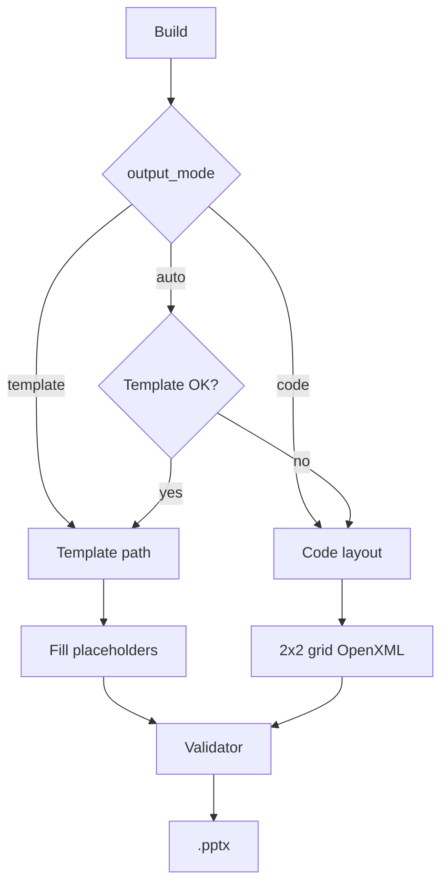

# Development Roadmap

[Persian](ROADMAP.fa.md) · [Back to README](../README.md)

Official development direction for **Pics2PPT** PPTX engine expansion.

---

## North Star

Build the best **photo folder → Persian RTL PowerPoint report** tool with:

- **Hybrid Smart** output (template when available, code fallback always works)
- **Expert Panel** for full PPTX control
- Maximum **python-pptx** + **OpenXML** + **Pillow** usage
- Automatic **QA** after every build

---

## Core Strategy: Hybrid Smart

| Mode | Behavior |
|------|----------|
| `auto` (default) | Use `.pptx` template if valid → else code layout (current engine) |
| `template` | Require template file; fail with clear error if missing |
| `code` | Force code-only layout (no template dependency) |

**Animations/transitions:** preserved only on **template path** (designed in PowerPoint, not edited by code).

**COM (optional Phase 4):** Windows + installed PowerPoint for post-process only if template path is insufficient.

---

## Expert Panel (Settings)

Advanced tab **PPTX Output** with:

- Output mode + template path
- Slide size presets (16:9, 4:3, A4)
- Typography, colors, grid, image pipeline
- Interactivity (click/hover zoom)
- Document metadata
- One-click presets: Report / Minimal / Print / Brand

Simple users use **presets**; power users use **Expert Panel**.

---

## Phases

| Phase | Focus | Status |
|-------|-------|--------|
| **0** | Refactor `pptx_builder` → `app/core/pptx/*`, HybridEngine skeleton, settings v6, basic Expert UI, docs | Done |
| **1** | TemplateLoader + `Pics2PPT_Default.pptx`, code fallback, `output_mode` setting | Done |
| **2** | Core properties, EXIF captions, OpenXML depth, validator + `build_report.json` | Done |
| **3** | Full Expert Panel, custom template import, presets, table index slide, 50+ tests | Done |
| **4** | Optional COM, LibreOffice preview, plugins | Done |

**Cross-check audit (4 passes):** [PPTX_GAP_AUDIT.md](PPTX_GAP_AUDIT.md) — **G1–G36** mapped; **final closure certificate** signed 2026-08-23.

See also: [PPTX_CAPABILITIES.md](PPTX_CAPABILITIES.md) for honest library limits.

---

## Phase detail (post web audit)

### Phase 0
- Split [`pptx_builder.py`](../app/core/pptx_builder.py) → `app/core/pptx/*`
- `HybridEngine` + `output_mode` setting skeleton
- `PptxOutputSettings` schema v2 + migration
- Expert Panel: mode, slide size, font sizes
- **G18:** pin `python-pptx>=1.0.2`; **G15:** RTL audit; **G21:** font fallback docs
- **G28:** filename XML safety test (`&` in names)
- **G32:** `.potx` template support in TemplateLoader

### Phase 1 — Template path + production discipline
- `TemplateLoader` + bundled `Pics2PPT_Default.pptx`
- **Run-safe fill** (no `.text` wipe) — SourceToDocs / python-pptx best practice
- **Template analyzer** (layout idx dump) — pbpython pattern
- `PicturePlaceholder.insert_picture()` + crop fill/fit modes
- Template zip **security guards**
- Code fallback unchanged behavior

### Phase 2 — Deep control
- Core + custom document properties
- Rich text: bullets, spacing, URL hyperlinks (**G22** text frame API)
- **G15** full RTL/bidi; **G16** master footer mode; **G17** a11y baseline
- EXIF captions, auto-rotate, optional GPS strip
- **p14:sectionLst** native PowerPoint sections (lxml)
- Optional code-path transition XML (fragile, flagged)
- **G30** openxml-audit in CI; `validator.py` + `build_report.json`

### Phase 3 — Competitive
- Full Expert Panel (colors, metadata, presets)
- Custom template import + layout wizard
- Table index slide; **G23** merge via slide-copier; **G19** optional compress-pptx
- Optional animation XML transplant (expert-only, warned)
- 50+ tests including template round-trip

### Phase 4 — Optional
- COM post-process (Windows + Office)
- LibreOffice PDF/PNG preview
- Plugin hooks

---

## Explicit non-goals (from audit)

| Feature | Decision |
|---------|----------|
| Charts / SmartArt | Out of scope for photo-report app |
| Aspose / cloud Slides API | Not offline portable mission |
| Programmatic animation in code path | Platform limit — use template |

---

## Three production workflows

| Workflow | Module |
|----------|--------|
| Template fill | `template_fill.py` — primary |
| Slide surgery | `deck_ops.py` — merge/reorder |
| Raw OpenXML | `openxml_ext.py` — hover, sections, transitions |

---

## Success Metrics

- **100%** builds succeed without template (code fallback)
- **Animations survive** template round-trip when template used
- **≥80%** relevant python-pptx features used in code paths
- **31 → 80+** automated tests (baseline v1.4.0 = **59**)
- Every build produces validator result (pass or explicit warning)

---

## What We Will Not Promise

| Limitation | Reason |
|------------|--------|
| Programmatic animations in code path | python-pptx has no animation API |
| Slide render to PNG in core | Requires LibreOffice or PowerPoint |
| macOS/Linux EXE parity | Windows-first portable target |

We document limits openly in [FAQ.md](FAQ.md).
